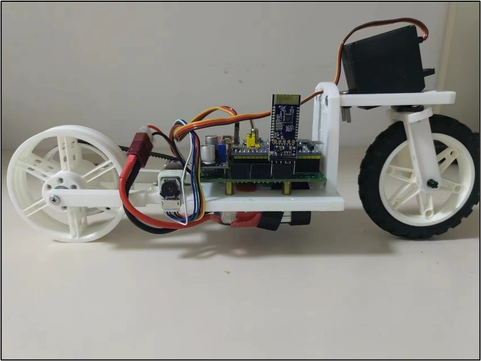

# Self-balance-bicycles
This is my first attempt at such a complete hardware development, which exists a lot of content is borrowed from the contents of other people online, so they can not be some of the non-open-source content directly public, I hope you more understanding, but I will also be the same attached to the reference link, easy to hope that the challenge of you can get the appropriate help.

# Reference
1. https://www.bilibili.com/video/BV1Ts4y127Qv/?spm_id_from=333.788&vd_source=54b64d3cd509c0c5b984cdd2008ef9a6（Refer to this for circuit design and program code.）
2. https://www.youtube.com/watch?v=YCpt_6-Z29M（Refer to this for the bicycle-frame）

# Some illustration
Most projects on the internet use momentum wheels directly to achieve balance correction, and the reason we don't use them in our project is because our instructor dosen't allow it. In this project, we do not intend to provide the stm32 code and the remote control APP for cell phones, these codes belong to other people's non-open source materials, please consult with the original author. (**Reference 1**)

# Final
Finally realized the finished product, in the degree of completion is very high, but in the balance of the effect is still to be improved, I hope that through our summary can inspire you, and then realize a more excellent finished product.
